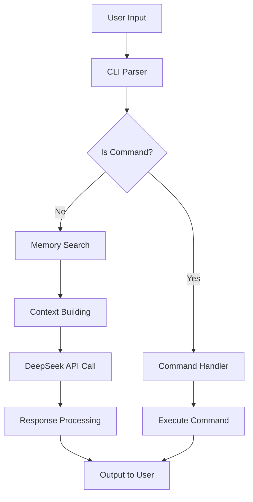

# Alma CLI - Documentación Técnica

## 📋 Especificaciones Técnicas

### Versión: 0.1.0
**Estado**: MVP Funcional  
**Última Actualización**: $(date)

## 🏗️ Arquitectura del Sistema

### Componentes Principales

```
Alma CLI Architecture
├── Frontend Layer
│   └── alma.py (CLI Interface)
├── Business Logic
│   ├── MemoryManager (memory.py)
│   └── DeepSeek API Client
├── Data Layer
│   └── SQLite Database
└── Infrastructure
    └── Docker Container
```

### Flujo de Datos



## 🔌 Configuración

### Variables de Entorno

| Variable | Requerido | Default | Descripción |
|----------|-----------|---------|-------------|
| `DEEPSEEK_API_KEY` | ✅ | - | API Key de DeepSeek |
| `DB_PATH` | ❌ | `/alma/db/alma.db` | Ruta de la base de datos |

### Estructura de Configuración

La aplicación utiliza **variables de entorno exclusivamente** para simplificar el deployment en Docker. No se utilizan archivos de configuración YAML/JSON.

## 🗄️ Base de Datos

### Schema Design

```sql
-- Tabla principal de memorias
CREATE TABLE IF NOT EXISTS memories (
    id INTEGER PRIMARY KEY AUTOINCREMENT,
    uuid TEXT UNIQUE NOT NULL DEFAULT (generate_uuid()),
    content TEXT NOT NULL,
    tags TEXT,
    project TEXT,
    theme TEXT,
    created_at DATETIME DEFAULT CURRENT_TIMESTAMP,
    importance INTEGER DEFAULT 2 CHECK (importance BETWEEN 1 AND 5),
    related_to TEXT CHECK(related_to IN (
        'architecture', 'philosophy', 'pentesting', 'programming'
    )),
    memory_type TEXT CHECK(memory_type IN (
        'institutional', 'context', 'alma', 'bird', 
        'architecture', 'structure', 'function'
    )),
    use_count INTEGER DEFAULT 0,
    last_used DATETIME DEFAULT CURRENT_TIMESTAMP
);
```

### Índices Optimizados

- `idx_memories_content` - Búsqueda full-text
- `idx_memories_tags` - Búsqueda por tags
- `idx_memories_importance` - Ordenamiento por relevancia
- `idx_memories_use_count` - Políticas LRU

### Políticas de Datos

- **LRU Eviction**: Máximo 500 memorias, elimina las menos usadas
- **Importancia Dinámica**: Memorias usadas frecuentemente aumentan importancia
- **Deduplicación**: Contenido idéntico se mergea automáticamente

## 🔍 Algoritmo de Búsqueda

### Extracción de Keywords

```python
def _extract_keywords(text: str) -> List[str]:
    # Filtrado de stop words en español
    stop_words = {'el', 'la', 'los', 'las', 'de', 'en', 'y', 'o', ...}
    words = re.findall(r'\b[a-záéíóúñ]{3,20}\b', text.lower())
    return [word for word in words if word not in stop_words][:10]
```

### Scoring de Relevancia

1. **Coincidencia de Keywords** (60% peso)
2. **Importancia de Memoria** (25% peso) 
3. **Frecuencia de Uso** (15% peso)

### Query Construction

```sql
SELECT * FROM memories 
WHERE (content LIKE ? OR tags LIKE ?)
ORDER BY importance DESC, use_count DESC
LIMIT 5
```

## 🤖 Integración con DeepSeek API

### Request Format

```json
{
  "model": "deepseek-chat",
  "messages": [
    {
      "role": "system",
      "content": "Eres Alma, asistente especializado...\nMEMORIAS RELEVANTES:\n- memoria1\n- memoria2"
    },
    {
      "role": "user", 
      "content": "mensaje del usuario"
    }
  ],
  "temperature": 0.7,
  "max_tokens": 1000
}
```

### Context Building

El sistema construye contexto dinámicamente:

```
MEMORIAS RELEVANTES:
- Los ataques XSS requieren validación de entrada
- SQL injection se previene con prepared statements
- Nmap es esencial para escaneo de redes
```

## 🐳 Docker Implementation

### Build Optimization

```dockerfile
# Multi-stage build ready
FROM python:3.11-alpine

# Layer caching optimizado
COPY pyproject.toml .
RUN pip install --no-cache-dir -e .

COPY src/ ./src/
# Los datos se persisten via volumes
```

### Volume Strategy

- `./db:/alma/db` - Base de datos persistente
- Los schemas se copian en build time
- Configuración via environment variables

### Network Considerations

- **Timeout**: 30 segundos para API calls
- **Retry Logic**: Implementada a nivel de aplicación
- **Health Checks**: Validación de BD al inicio

## 🧪 Testing Strategy

### Pruebas Unitarias Recomendadas

```python
# tests/test_memory.py
def test_memory_search_relevance():
    manager = MemoryManager()
    results = manager.search_memories("pentesting tools")
    assert len(results) <= 5
    assert all('pentesting' in r['content'].lower() for r in results)

def test_memory_persistence():
    manager = MemoryManager()
    initial_count = manager.get_stats()['total_memories']
    manager.add_memory("test memory")
    assert manager.get_stats()['total_memories'] == initial_count + 1
```

### Integration Testing

```bash
# Test completo del flujo
echo "TEST: Basic functionality"
docker run -it --env-file .env alma-cli <<EOF
/add test memory
¿qué es testing?
exit
EOF
```

## 📈 Métricas y Monitoreo

### Estadísticas Recopiladas

- Total de memorias en base de datos
- Distribución por importancia (1-5 estrellas)
- Memorias nunca utilizadas
- Tasa de uso promedio
- Relaciones entre memorias

### Comando de Estadísticas

```bash
🧑 Tú: /stats
📊 Estadísticas de Memorias:
  Total: 47
  Uso promedio: 2.3
  Sin usar: 5
  Distribución por importancia:
    1⭐: 3
    2⭐: 15  
    3⭐: 20
    4⭐: 7
    5⭐: 2
```

## 🔒 Consideraciones de Seguridad

### API Key Management

- Las keys se injectan via environment variables
- Nunca se commitean al repositorio
- Rotación recomendada cada 90 días

### Data Protection

- Base de datos local, sin datos sensibles en la nube
- Solo metadata de conversaciones, no contenido crítico
- UUIDs en lugar de IDs secuenciales para anonimización

## 🚀 Roadmap

### V0.2.0 (Próxima)
- [ ] Sistema de relaciones entre memorias
- [ ] Comando de optimización de BD
- [ ] Export/import de memorias
- [ ] Búsqueda avanzada con operadores

### V0.3.0 (Futuro)  
- [ ] Multi-modal (imágenes, documentos)
- [ ] Plugins system
- [ ] Web interface
- [ ] API REST

## 🐛 Troubleshooting Avanzado

### Error: Database Locked

**Causa**: Múltiples instancias accediendo la misma BD
**Solución**: Asegurar solo una instancia por volumen

### Error: API Rate Limit

**Síntoma**: Timeouts o errores 429
**Solución**: Implementar exponential backoff

### Error: Memory Corruption

**Síntoma**: Búsquedas retornan resultados inconsistentes
**Solución**: Ejecutar `/optimize` para reparar índices

## 🔗 Dependencies

### Runtime
- `python:3.11-alpine` - Base image optimizada
- `requests>=2.25.0` - HTTP client
- `sqlite3` - Base de datos embebida

### Development
- `pytest` - Testing framework
- `black` - Code formatting
- `mypy` - Type checking

---

**Documentación Mantenida por**: Alma CLI Team  
**Última Revisión**: $(date)