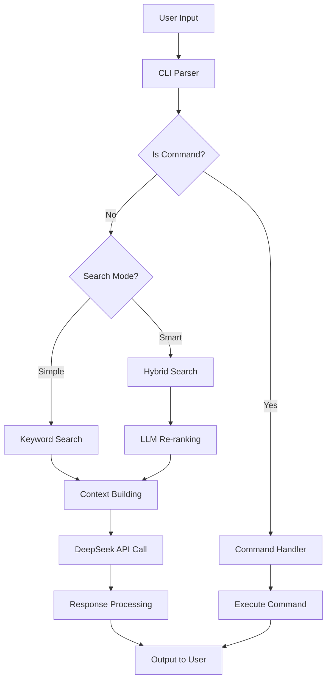

# Alma CLI - Documentación Técnica

## 📋 Especificaciones Técnicas

### Versión: 0.0.2
**Estado**: MVP Mejorado con Búsqueda Inteligente  
**Última Actualización**: 2025-11-21

## 🏗️ Arquitectura del Sistema

### Componentes Principales

```
Alma CLI Architecture
├── Frontend Layer
│   └── alma.py (CLI Interface + Search Mode Controller)
├── Business Logic
│   ├── MemoryManager (memory.py) - Búsqueda Híbrida
│   │   ├── search_memories_simple() - Keywords
│   │   └── search_memories_enhanced() - LLM Re-ranking
│   └── DeepSeek API Client (Doble uso: Chat + Re-ranking)
├── Data Layer
│   └── SQLite Database con Schema UUID
└── Infrastructure
    └── Docker Container
```

### Flujo de Datos Mejorado



## 🔌 Configuración

### Variables de Entorno

| Variable | Requerido | Default | Descripción |
|----------|-----------|---------|-------------|
| `DEEPSEEK_API_KEY` | ✅ | - | API Key para DeepSeek (Chat + Re-ranking) |
| `DB_PATH` | ❌ | `/alma/db/alma.db` | Ruta de la base de datos |

## 🧠 Sistema de Memoria Mejorado

### Búsqueda Híbrida

```python
def search_memories_enhanced(query: str, use_llm: bool = True) -> List[Dict]:
    """Búsqueda híbrida: keywords + optional LLM re-ranking"""
    # 1. Búsqueda inicial por keywords
    candidates = search_memories_simple(query, limit * 2)
    
    if use_llm and len(candidates) > 1:
        # 2. Re-ranking con LLM para relevancia semántica
        return rerank_with_llm(query, candidates)[:limit]
    
    return candidates[:limit]
```

### Algoritmos de Búsqueda

#### Modo Simple (Keyword-based)
- **Velocidad**: ⚡️ Muy rápido
- **Precisión**: ✅ Buena para coincidencias exactas
- **Uso**: Búsquedas generales, listado rápido

#### Modo Smart (LLM-enhanced)  
- **Velocidad**: 🐢 Moderado (+ llamada API)
- **Precisión**: 🎯 Excelente relevancia semántica
- **Uso**: Consultas complejas, contexto específico

### Re-ranking con LLM

```python
def _rerank_with_llm(query: str, memories: List[Dict]) -> List[int]:
    """Usa DeepSeek para ordenar memorias por relevancia"""
    prompt = f"""Evalúa relevancia con: "{query}"
    
Memorias:
{chr(10).join([f"{i+1}. {m['content'][:150]}..." for i, m in enumerate(memories)])}

Devuelve SOLO números de las 5 más relevantes en orden:"""
    
    response = _call_llm_api(prompt, max_tokens=100)
    return parse_ranked_indices(response)
```

## 🗄️ Base de Datos

### Schema Design (Sin Cambios)

```sql
-- Tabla principal de memorias (UUID-based)
CREATE TABLE IF NOT EXISTS memories (
    id INTEGER PRIMARY KEY AUTOINCREMENT,
    uuid TEXT UNIQUE NOT NULL DEFAULT (lower(hex(randomblob(4))) || '-' || lower(hex(randomblob(2))) || '-4' || substr(lower(hex(randomblob(2))), 2) || '-a' || substr(lower(hex(randomblob(2))), 2) || '-' || lower(hex(randomblob(6)))),
    content TEXT NOT NULL,
    tags TEXT,
    project TEXT,
    theme TEXT,
    created_at DATETIME DEFAULT CURRENT_TIMESTAMP,
    importance INTEGER DEFAULT 2 CHECK (importance BETWEEN 1 AND 5),
    related_to TEXT CHECK(related_to IN ('architecture', 'philosophy', 'pentesting', 'programming')),
    memory_type TEXT CHECK(memory_type IN ('institutional', 'context', 'alma', 'bird', 'architecture', 'structure', 'function')),
    use_count INTEGER DEFAULT 0,
    last_used DATETIME DEFAULT CURRENT_TIMESTAMP
);
```

### Inicialización de Datos

```bash
# Cargar 30 memorias base sobre Alma
./src/alma/utils/inject_memories.sh
```

Las memorias incluyen:
- **Institutional**: Conocimiento fundamental del sistema
- **Structure**: Arquitectura y componentes
- **Function**: Comportamiento y comandos
- **Alma**: Visión y roadmap futuro

## 🔍 Algoritmos de Búsqueda Actualizados

### Extracción de Keywords (Modo Simple)

```python
def _extract_keywords(text: str) -> List[str]:
    stop_words = {'el', 'la', 'los', 'las', 'de', 'en', 'y', 'o', 'pero', 'para'}
    words = re.findall(r'\b[a-záéíóúñ]{3,20}\b', text.lower())
    return [word for word in words if word not in stop_words][:10]
```

### Scoring Híbrido (Modo Smart)

1. **Coincidencia Keywords** (Búsqueda inicial)
2. **Re-ranking Semántico** (LLM evaluation)
3. **Importancia + Uso** (Ordenamiento final)

## 🤖 Integración DeepSeek API

### Uso Doble de la API

#### 1. Generación de Respuestas
```python
# Chat principal
data = {
    "model": "deepseek-chat",
    "messages": [
        {"role": "system", "content": f"Eres Alma...\n{context}"},
        {"role": "user", "content": message}
    ],
    "temperature": 0.7,
    "max_tokens": 1000
}
```

#### 2. Re-ranking de Memorias
```python
# Re-ranking optimizado
data = {
    "model": "deepseek-chat", 
    "messages": [{"role": "user", "content": rerank_prompt}],
    "temperature": 0.1,  # Baja para consistencia
    "max_tokens": 100    # Respuesta corta
}
```

## 🐳 Docker Implementation

### Build Optimizado

```dockerfile
FROM python:3.11-alpine

WORKDIR /alma

RUN apk add --no-cache sqlite

COPY pyproject.toml .
RUN pip install --no-cache-dir -e .

COPY meta/schema.sql .
COPY src/ ./src/
RUN mkdir -p db

CMD ["python", "-c", "from alma.alma import main; main()"]
```

### Ejecución Recomendada

```bash
# Build una vez
docker build -t alma-cli .

# Ejecutar interactivamente
docker run -it --env-file .env -v $(pwd)/db:/alma/db alma-cli
```

## 📊 Métricas y Monitoreo

### Estadísticas Recopiladas

- Total de memorias y distribución por tipo
- Eficiencia de búsqueda (simple vs smart)
- Tasa de uso de memorias
- Performance de llamadas API

### Comandos de Diagnóstico

```bash
🧑 Tú: /searchmode
🔍 Modo de búsqueda cambiado a: smart (con LLM)

🧑 Tú: /memories
📚 Últimas memorias (re-rankeadas por relevancia):
  1. Alma es un CLI chat especializado... (usos: 5)
  2. El sistema de Alma usa SQLite con UUIDs... (usos: 3)
```

## 🔒 Consideraciones de Seguridad

### API Key Management
- **Doble uso**: Misma key para chat y re-ranking
- **Rate limiting**: Control de llamadas consecutivas
- **Timeout**: 30 segundos por defecto

### Data Protection
- **Local-first**: Toda la data permanece local
- **UUIDs**: Identificadores anónimos
- **No PII**: Solo contenido técnico, no datos personales

## 🚀 Roadmap

### V0.1.0 (Próxima)
- [ ] Comando `/stats` para métricas del sistema
- [ ] Comando `/optimize` para mantenimiento de BD
- [ ] Cache de embeddings para búsquedas más rápidas
- [ ] Sistema de plugins para herramientas de pentesting

### V0.2.0 (Futuro)
- [ ] Integración con nmap, metasploit, burp suite
- [ ] Sistema de relaciones entre memorias
- [ ] Export/import de bases de conocimiento
- [ ] API REST para integraciones

## 🧪 Testing Strategy

### Pruebas de Búsqueda Híbrida

```python
def test_hybrid_search_fallback():
    """Prueba fallback a búsqueda simple cuando LLM falla"""
    manager = MemoryManager(api_key="invalid_key")
    results = manager.search_memories_enhanced("test query", use_llm=True)
    assert len(results) > 0  # Debe fallar gracefulmente a simple search

def test_search_mode_switching():
    """Prueba cambio entre modos de búsqueda"""
    # Verificar que /searchmode alterna correctamente
```

## 🐛 Troubleshooting Avanzado

### Error: LLM Re-ranking Timeout
**Síntoma**: Búsqueda smart muy lenta
**Solución**: Cambiar a modo simple con `/searchmode`

### Error: API Rate Limit Exceeded
**Síntoma**: Errores 429 en búsquedas smart
**Solución**: Sistema automáticamente usa fallback a simple

### Error: Memory Consistency
**Síntoma**: Resultados inconsistentes entre modos
**Solución**: Ejecutar script de inicialización para reset

## 🔗 Dependencies

### Runtime
- `python:3.11-alpine` - Base image optimizada
- `requests>=2.25.0` - HTTP client para DeepSeek API
- `sqlite3` - Base de datos embebida

### No Dependencies Externas
- **Sin vector databases** - Búsqueda semántica via API
- **Sin ORM complejo** - SQLite directo
- **Sin web frameworks** - CLI puro

---

**Documentación Mantenida por**: Alma CLI Team  
**Última Revisión**: 2024-04-06  
**Versión Documentada**: 0.0.2
```